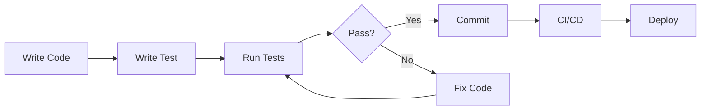

# Testing Strategy for Learn and Play Web Application
**Date:** 2025-09-07
**Author:** AI Assistant
**Purpose:** Establish testing practices for the Learn and Play project

## 📚 Testing Overview for Web Applications

### Testing Pyramid for Web Projects
```
         /\
        /E2E\        <- End-to-End Tests (10%)
       /------\         Test full user workflows
      /  Integ \     <- Integration Tests (30%)
     /----------\       Test components working together
    /    Unit    \   <- Unit Tests (60%)
   /--------------\     Test individual functions
```

## 🎯 1. Testing Strategy for Learn and Play

### A. Testing Approach Selection

Given the project characteristics:
- **Vanilla JavaScript** (no framework like React/Angular)
- **Multiple independent games**
- **Common utilities being extracted**
- **Educational focus** (reliability is critical)

**Recommended Approach: Progressive Testing**

1. **Start Simple**: Basic unit tests for utilities
2. **Add Integration**: Test game components
3. **Manual E2E**: User acceptance testing
4. **Automate Critical Paths**: Key user journeys

### B. Testing Tools Recommendation

#### For This Project (Simplest to Most Complex):

**Option 1: Browser-Based Testing (Recommended Start)**
```javascript
// tests/test-runner.html
<!DOCTYPE html>
<html>
<head>
    <title>Test Suite</title>
    <style>
        .pass { color: green; }
        .fail { color: red; }
        .test-result { margin: 10px; padding: 5px; border: 1px solid #ccc; }
    </style>
</head>
<body>
    <h1>Learn and Play Test Suite</h1>
    <div id="test-results"></div>

    <script type="module">
        import { runTests } from './test-framework.js';
        import { arrayTests } from './unit/array.test.js';
        import { audioTests } from './unit/audio.test.js';
        import { gameTests } from './integration/memory-game.test.js';

        runTests([
            ...arrayTests,
            ...audioTests,
            ...gameTests
        ]);
    </script>
</body>
</html>
```

**Option 2: Jest (Industry Standard)**
```bash
npm init -y
npm install --save-dev jest jsdom
```

**Option 3: Mocha + Chai (Flexible)**
```bash
npm install --save-dev mocha chai
```

### C. Simple Test Framework Implementation

```javascript
// tests/test-framework.js
export class TestFramework {
    constructor() {
        this.tests = [];
        this.results = [];
    }

    describe(suiteName, testFunction) {
        console.group(suiteName);
        testFunction();
        console.groupEnd();
    }

    it(testName, testFunction) {
        try {
            testFunction();
            this.pass(testName);
        } catch (error) {
            this.fail(testName, error);
        }
    }

    expect(actual) {
        return {
            toBe(expected) {
                if (actual !== expected) {
                    throw new Error(`Expected ${expected} but got ${actual}`);
                }
            },
            toEqual(expected) {
                if (JSON.stringify(actual) !== JSON.stringify(expected)) {
                    throw new Error(`Expected ${JSON.stringify(expected)} but got ${JSON.stringify(actual)}`);
                }
            },
            toContain(item) {
                if (!actual.includes(item)) {
                    throw new Error(`Expected array to contain ${item}`);
                }
            },
            toBeTruthy() {
                if (!actual) {
                    throw new Error(`Expected truthy value but got ${actual}`);
                }
            },
            toThrow() {
                let threw = false;
                try {
                    actual();
                } catch (e) {
                    threw = true;
                }
                if (!threw) {
                    throw new Error('Expected function to throw');
                }
            }
        };
    }

    pass(testName) {
        console.log('✓', testName);
        this.results.push({ name: testName, passed: true });
    }

    fail(testName, error) {
        console.error('✗', testName, error.message);
        this.results.push({ name: testName, passed: false, error: error.message });
    }

    getResults() {
        const passed = this.results.filter(r => r.passed).length;
        const failed = this.results.filter(r => !r.passed).length;
        return {
            total: this.results.length,
            passed,
            failed,
            results: this.results
        };
    }
}

export const test = new TestFramework();
export const { describe, it, expect } = test;

export function runTests(testModules) {
    testModules.forEach(module => module());

    const results = test.getResults();
    const resultsDiv = document.getElementById('test-results');

    resultsDiv.innerHTML = `
        <h2>Results: ${results.passed}/${results.total} passed</h2>
        ${results.results.map(r => `
            <div class="test-result ${r.passed ? 'pass' : 'fail'}">
                ${r.passed ? '✓' : '✗'} ${r.name}
                ${r.error ? `<br><small>${r.error}</small>` : ''}
            </div>
        `).join('')}
    `;
}
```

## 🧪 2. Regression Tests

### A. Current Code - Core Functionality Tests

#### Test Suite 1: Memory Game Engine
```javascript
// tests/regression/memory-game.test.js
import { describe, it, expect } from '../test-framework.js';

export function memoryGameTests() {
    describe('Memory Game Engine', () => {

        it('should shuffle array properly', () => {
            const original = [1, 2, 3, 4, 5];
            const shuffled = MemoryGame.shuffleArray([...original]);

            expect(shuffled.length).toBe(original.length);
            expect(shuffled.sort()).toEqual(original);
            // Statistical test - at least one element should be in different position
            let isDifferent = false;
            for (let i = 0; i < original.length; i++) {
                if (original[i] !== shuffled[i]) {
                    isDifferent = true;
                    break;
                }
            }
            expect(isDifferent).toBeTruthy();
        });

        it('should prepare game data with correct number of pairs', () => {
            const mockData = {
                entries: [
                    { base: 'word1', alternatives: ['alt1', 'alt2'] },
                    { base: 'word2', alternatives: ['alt3', 'alt4'] },
                    // ... more entries
                ]
            };

            const gamePairs = MemoryGame.prepareGameData(mockData);
            expect(gamePairs.length).toBe(10); // Should always be 10 pairs
        });

        it('should detect matching pairs correctly', () => {
            MemoryGame.synonymPairs = {
                'word1': 'match1',
                'match1': 'word1',
                'word2': 'match2',
                'match2': 'word2'
            };

            MemoryGame.firstCard = { dataset: { word: 'word1' } };
            MemoryGame.secondCard = { dataset: { word: 'match1' } };

            const isMatch = MemoryGame.checkForMatch();
            expect(isMatch).toBeTruthy();
        });

        it('should handle card clicks correctly', () => {
            const mockCard = document.createElement('div');
            mockCard.dataset.word = 'test';

            // First click
            MemoryGame.handleCardClick(mockCard);
            expect(MemoryGame.firstCard).toBe(mockCard);

            // Second click on different card
            const mockCard2 = document.createElement('div');
            mockCard2.dataset.word = 'test2';
            MemoryGame.handleCardClick(mockCard2);
            expect(MemoryGame.secondCard).toBe(mockCard2);
        });

        it('should reset game state properly', () => {
            MemoryGame.pairsFound = 5;
            MemoryGame.firstCard = 'something';
            MemoryGame.lockBoard = true;

            MemoryGame.resetGameState();

            expect(MemoryGame.pairsFound).toBe(0);
            expect(MemoryGame.firstCard).toBe(null);
            expect(MemoryGame.lockBoard).toBe(false);
        });
    });
}
```

#### Test Suite 2: Topic List Loading
```javascript
// tests/regression/topic-list.test.js
export function topicListTests() {
    describe('Topic List', () => {

        it('should load topics from JSON', async () => {
            // Mock fetch
            global.fetch = jest.fn(() =>
                Promise.resolve({
                    ok: true,
                    json: () => Promise.resolve({
                        'topic1.json': { total_entries: 50 },
                        'topic2.json': { total_entries: 30 }
                    })
                })
            );

            await loadTopics();

            const buttons = document.querySelectorAll('button');
            expect(buttons.length).toBe(2);
        });

        it('should create buttons with correct attributes', () => {
            const mockTopics = {
                'הפכים.json': { total_entries: 100 },
                'מילים_נרדפות.json': { total_entries: 75 }
            };

            createTopicButtons(mockTopics);

            const firstButton = document.querySelector('button');
            expect(firstButton.dataset.filepath).toBe('./data/הפכים.json');
            expect(firstButton.textContent).toContain('100');
        });
    });
}
```

### B. Refactored Code - Common Library Tests

#### Test Suite 3: Common Utilities
```javascript
// tests/unit/common-utils.test.js
import { shuffleArray, pickRandom, unique } from '../../common/utils/array.js';
import { describe, it, expect } from '../test-framework.js';

export function commonUtilsTests() {
    describe('Common Array Utilities', () => {

        it('shuffleArray should maintain array length', () => {
            const input = [1, 2, 3, 4, 5];
            const result = shuffleArray([...input]);
            expect(result.length).toBe(input.length);
        });

        it('shuffleArray should contain all original elements', () => {
            const input = ['a', 'b', 'c'];
            const result = shuffleArray([...input]);

            input.forEach(item => {
                expect(result).toContain(item);
            });
        });

        it('pickRandom should return requested number of elements', () => {
            const input = [1, 2, 3, 4, 5, 6, 7, 8, 9, 10];
            const result = pickRandom(input, 3);
            expect(result.length).toBe(3);
        });

        it('pickRandom should not return duplicates', () => {
            const input = [1, 2, 3, 4, 5];
            const result = pickRandom(input, 3);
            const uniqueResult = [...new Set(result)];
            expect(uniqueResult.length).toBe(result.length);
        });

        it('unique should remove duplicates', () => {
            const input = [1, 2, 2, 3, 3, 3, 4];
            const result = unique(input);
            expect(result).toEqual([1, 2, 3, 4]);
        });
    });
}
```

#### Test Suite 4: AudioManager
```javascript
// tests/unit/audio-manager.test.js
export function audioManagerTests() {
    describe('AudioManager', () => {

        it('should initialize AudioContext', () => {
            const manager = new AudioManager();
            const initialized = manager.init();

            expect(initialized).toBeTruthy();
            expect(manager.audioContext).toBeTruthy();
        });

        it('should handle missing Web Audio API gracefully', () => {
            const originalAudioContext = window.AudioContext;
            delete window.AudioContext;
            delete window.webkitAudioContext;

            const manager = new AudioManager();
            const initialized = manager.init();

            expect(initialized).toBe(false);

            // Restore
            window.AudioContext = originalAudioContext;
        });

        it('should play predefined sounds', () => {
            const manager = new AudioManager();
            manager.init();

            // Mock the playTone method
            let playedFrequency;
            manager.playTone = (freq) => { playedFrequency = freq; };

            manager.playSound('success');
            expect(playedFrequency).toBe(600);
        });

        it('should handle volume changes', () => {
            const manager = new AudioManager();

            manager.setVolume(0.5);
            expect(manager.masterVolume).toBe(0.5);

            manager.setVolume(1.5); // Should clamp to 1
            expect(manager.masterVolume).toBe(1);

            manager.setVolume(-1); // Should clamp to 0
            expect(manager.masterVolume).toBe(0);
        });
    });
}
```

### C. Integration Tests

```javascript
// tests/integration/game-flow.test.js
export function gameFlowTests() {
    describe('Complete Game Flow', () => {

        it('should complete a full game cycle', async () => {
            // 1. Load topics
            await loadTopics();

            // 2. Select a topic
            const topicButton = document.querySelector('button[data-filepath]');
            topicButton.click();

            // 3. Verify game board is created
            const gameBoard = document.querySelector('.game-board');
            expect(gameBoard).toBeTruthy();

            // 4. Verify correct number of cards
            const cards = document.querySelectorAll('.memory-card');
            expect(cards.length).toBe(20);

            // 5. Simulate finding all pairs
            for (let i = 0; i < 10; i++) {
                // Find matching pair
                const pair = findMatchingPair();
                pair[0].click();
                pair[1].click();

                // Wait for animation
                await wait(600);
            }

            // 6. Verify win condition
            const winMessage = document.querySelector('.win-message');
            expect(winMessage).toBeTruthy();
        });

        it('should handle topic change correctly', () => {
            // Start a game
            MemoryGame.init('./data/topic1.json');

            // Change topic
            const changeButton = document.querySelector('#change-topic-btn');
            changeButton.click();

            // Verify topic selection is visible again
            const topicSelection = document.querySelector('#topic-selection-container');
            expect(topicSelection.style.display).not.toBe('none');

            // Verify game is hidden
            const gameContainer = document.querySelector('.memory-game-container');
            expect(gameContainer.style.display).toBe('none');
        });
    });
}
```

## 🔄 3. Test Execution Strategy

### A. Manual Testing Checklist

```markdown
## Manual Test Checklist - Memory Game

### Topic Selection
- [ ] All topics appear in the list
- [ ] Topic counts are correct
- [ ] Clicking topic starts game

### Game Board
- [ ] 20 cards appear (10 pairs)
- [ ] Cards flip on click
- [ ] Cannot click same card twice
- [ ] Cannot click while checking match

### Matching Logic
- [ ] Correct pairs stay visible
- [ ] Incorrect pairs flip back
- [ ] Score updates correctly
- [ ] Success sound plays

### Game Controls
- [ ] Reset button works
- [ ] Change topic returns to selection
- [ ] Win message appears at 10 pairs

### Cross-browser Testing
- [ ] Chrome
- [ ] Firefox
- [ ] Safari
- [ ] Edge
- [ ] Mobile browsers
```

### B. Automated Test Execution

```bash
# Simple approach - open in browser
python -m http.server 8000
# Navigate to http://localhost:8000/tests/test-runner.html

# With npm/Jest
npm test

# With coverage
npm test -- --coverage

# Watch mode
npm test -- --watch
```

### C. Continuous Testing Script

```javascript
// tests/watch.js
const fs = require('fs');
const { exec } = require('child_process');

const watchDirectories = [
    './common',
    './language',
    './tests'
];

console.log('Watching for changes...');

watchDirectories.forEach(dir => {
    fs.watch(dir, { recursive: true }, (eventType, filename) => {
        if (filename.endsWith('.js')) {
            console.log(`Change detected in ${filename}, running tests...`);
            exec('npm test', (error, stdout, stderr) => {
                console.log(stdout);
                if (error) {
                    console.error(stderr);
                }
            });
        }
    });
});
```

## 📋 4. Test Coverage Requirements

### Minimum Coverage Goals

| Component | Unit Tests | Integration Tests | Coverage Target |
|-----------|------------|------------------|-----------------|
| Common Utils | Required | Optional | 95% |
| Game Logic | Required | Required | 85% |
| UI Components | Optional | Required | 70% |
| Data Loading | Required | Required | 90% |
| Audio | Optional | Manual | 60% |

### Critical Path Coverage (Must Have 100%)

1. **Card Matching Logic** - Core game functionality
2. **Score Calculation** - User progress tracking
3. **Data Loading** - Game initialization
4. **Shuffle Algorithm** - Fair gameplay

## 🎯 5. Testing Best Practices for This Project

### DO's
✅ **Test pure functions first** - Easy wins
✅ **Use descriptive test names** - "should detect matching Hebrew words"
✅ **Test edge cases** - Empty arrays, null values
✅ **Mock external dependencies** - fetch, AudioContext
✅ **Keep tests fast** - < 100ms per unit test
✅ **Test user flows** - Complete game scenarios

### DON'Ts
❌ **Don't test implementation details** - Focus on behavior
❌ **Don't test external libraries** - Trust Tone.js works
❌ **Don't ignore failing tests** - Fix or remove
❌ **Don't write brittle tests** - Avoid timing dependencies
❌ **Don't skip error cases** - Test failure paths

## 🔍 6. Debugging Test Failures

### Common Issues and Solutions

| Issue | Symptom | Solution |
|-------|---------|----------|
| Async timing | Tests pass individually, fail together | Add proper await/delays |
| DOM not ready | "Cannot read property of null" | Use DOMContentLoaded or setup |
| State pollution | Tests affect each other | Reset state in beforeEach |
| Browser differences | Works in Chrome, fails in Firefox | Use polyfills or feature detection |
| Random failures | Shuffle tests occasionally fail | Use seeded random for tests |

### Debug Helper Functions

```javascript
// tests/helpers/debug.js
export function logDOM() {
    console.log(document.body.innerHTML);
}

export function waitFor(condition, timeout = 3000) {
    return new Promise((resolve, reject) => {
        const start = Date.now();
        const interval = setInterval(() => {
            if (condition()) {
                clearInterval(interval);
                resolve();
            } else if (Date.now() - start > timeout) {
                clearInterval(interval);
                reject(new Error('Timeout waiting for condition'));
            }
        }, 100);
    });
}

export function mockLocalStorage() {
    const store = {};
    return {
        getItem: (key) => store[key] || null,
        setItem: (key, value) => store[key] = value.toString(),
        removeItem: (key) => delete store[key],
        clear: () => Object.keys(store).forEach(key => delete store[key])
    };
}
```

## 📝 7. Test Documentation Template

```javascript
/**
 * Test Suite: [Component Name]
 * Purpose: [What this suite tests]
 * Dependencies: [What needs to be mocked]
 *
 * Test Cases:
 * 1. [Happy path scenario]
 * 2. [Edge case 1]
 * 3. [Error handling]
 *
 * Known Issues:
 * - [Any flaky tests or limitations]
 *
 * Last Updated: [Date]
 * Author: [Name]
 */
```

## 🚀 Quick Start Testing Commands

```bash
# 1. Create test structure
mkdir -p tests/{unit,integration,regression,helpers}

# 2. Create test runner
echo '<!DOCTYPE html>...' > tests/test-runner.html

# 3. Create first test
echo 'export function arrayTests() {...}' > tests/unit/array.test.js

# 4. Run tests
python -m http.server 8000
# Open http://localhost:8000/tests/test-runner.html
```

## 📊 Testing Metrics to Track

1. **Test Count**: Total number of tests
2. **Pass Rate**: Percentage of passing tests
3. **Coverage**: Line/branch coverage percentage
4. **Execution Time**: How long tests take to run
5. **Flakiness**: Tests that fail intermittently
6. **Test Debt**: Untested code sections

## 🔄 Testing in Development Workflow


